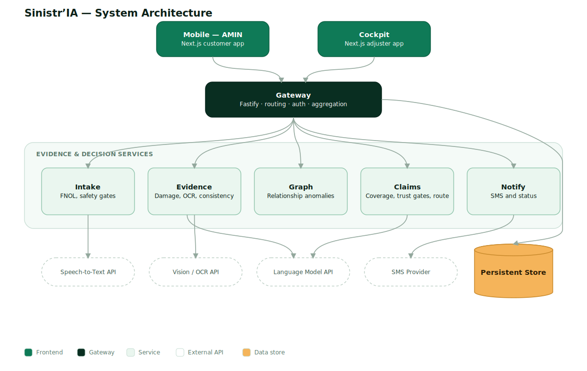
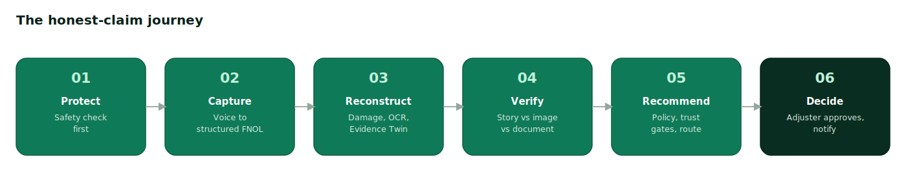

# Sinistr'IA - Architecture

How the repo is structured and how the parts talk to each other. For scope and
roadmap see [plan.md](plan.md).



## 1. Principles

- One shared contract. The Accident Evidence Twin lives in `packages/contracts`
  and is the single source of truth. Every service and app imports it. No part
  redefines its own copy.
- Clear boundaries. Services expose HTTP contracts and never reach into each
  other's internals. The gateway is the only entry point for the frontends.
- Pretrained where possible, rules where safer, offline where critical.
  Hosted models for speech, vision, and language. Deterministic gates for
  eligibility, safety, coverage, and escalation. Local caches for demo media,
  policy excerpts, and graph data.
- One coherent system on screen. The audience sees one Evidence Twin, not
  internal orchestration.

## 2. Folder tree

```text
sinistria/
  apps/
    mobile/        Customer Derja journey (Next.js)
    cockpit/       Adjuster cockpit (Next.js)
  services/
    gateway/       API gateway and backend-for-frontend
    intake/        Voice and text intake, safety and eligibility gates
    evidence/      Multimodal intelligence, builds the Evidence Twin
    claims/        Policy grounding, trust gates, recommendation and route
    graph/         Relationship graph and anomaly flags
    notify/        SMS and status updates
    signals/       Standalone situational feed, not part of the claim pipeline
  packages/
    contracts/     Accident Evidence Twin schema, DTOs, event types (shared)
    config/        Env parsing and validation, shared constants and thresholds
    logger/        Structured logging and request context
    service-kit/   Shared Fastify bootstrap (health, correlation id, shutdown)
    ui/            Shared React components and design tokens
  infra/
    docker/        Per-service Dockerfiles
    compose/       docker compose for local orchestration
  data/
    claims/        Synthetic simple motor claims
    policies/      Policy and guarantee examples with coverage clauses
    media/         Constat and damage images, audio samples
    graph/         Seeded relationship graph
  docs/            Plan, architecture, conventions, decisions, improvements
  scripts/         Developer and setup scripts (including smoke.sh)
  tests/
    e2e/           In-process end-to-end pipeline tests over the demo cases
```

Each service also exposes its pure core through a `./core` package export. The
Fastify route is a thin wrapper over that core, so the same logic runs over HTTP
in production and in-process in the e2e test. See decision D-0005.

See [conventions.md](conventions.md) for commit, branch, and code-style rules.

## 3. Layers and services

### Customer capture layer

- `apps/mobile`. Calm, guided mobile web journey. Safety question first, one
  instruction at a time, confirm extracted facts, visible completeness. Derja
  with French fallback. Entry by link or QR.
- `services/intake`. Orchestrates hosted speech to text, structures FNOL fields
  (actors, vehicles, time, location, collision direction), and runs the safety
  gate (injury or danger) and eligibility gate (property-damage-only, clear
  coverage). Does not make routing or recommendation decisions.

### Evidence intelligence layer

- `services/evidence`. Guided-capture checks (blur, angle, completeness), image
  quality and damage localization with a visible-damage severity range, OCR and
  document structuring, and cross-modal consistency (story versus image versus
  document). Assembles the Accident Evidence Twin. Produces evidence and
  confidence, never a payout.
- `services/graph`. Seeded relationship graph over claims, vehicles, phone
  numbers, and garages. Emits anomaly flags (reused image, shared garage phone,
  invoice category mismatch). Flags inconsistencies, never accuses a person.

### Claims cockpit layer

- `services/claims`. Policy-grounded retrieval of coverage clauses and
  exclusions, trust gates (confidence thresholds and escalation triggers), and a
  recommendation with a route (fast-track, review, investigate), reasons, and a
  confidence label. Human approval is required before any financial decision.
- `apps/cockpit`. Shows the Twin in a decision, why, proof hierarchy. Top: the
  recommended route, confidence, urgency, and the human action. Middle: the
  coverage clause, completeness, consistency, and risk signals. Bottom: the
  voice excerpt, image region, and editable source field.
- `services/notify`. Sends the customer an SMS or status update after approval.
  Hosted SMS provider with an offline fallback for the demo.

### Integration

- `services/gateway`. The only entry point for the frontends. Routing, role
  based access (customer versus adjuster), request aggregation, and rate
  limiting. Holds no business logic.

### Standalone (outside the claim pipeline)

- `services/signals`. A situational-awareness feed: regional events (floods,
  road incidents, outbreaks) classified with a criticality label and the motor
  concerns they may touch, for adjuster context only. Reached by the gateway's
  additive `GET /api/signals` read-through and shown on its own cockpit page
  (`/signals`). Never called from `runClaimPipeline`, never reads or writes an
  Accident Evidence Twin, and shares no code with the graph service. See
  decision D-0027. Matching an event to a specific claim's time and place is a
  deliberate follow-up, not built here (see [backlog.md](backlog.md)).

## 4. The Accident Evidence Twin

The canonical structured claim object. Defined once in `packages/contracts`.

Contents:

- Structured facts: actors, vehicles, time, location.
- Event timeline: sequence and collision direction.
- Damage evidence: visible areas and a severity range.
- Coverage evidence: matched clauses and exclusions.
- Consistency evidence: contradictions and benign gaps.
- Confidence and provenance: the source of every field and its uncertainty.

Outputs a route (fast-track, human clarification, investigation), a draft
customer communication, and a full audit trail.

## 5. Request path (honest claim)



```text
mobile
  -> gateway            (auth, route)
  -> intake             (transcribe, structure FNOL, safety and eligibility gates)
  -> evidence           (guided-capture checks, OCR, damage, consistency, build Twin)
  -> claims + graph     (policy grounding, trust gates, recommendation; anomaly flags)
  -> gateway
  -> cockpit            (adjuster reviews the Twin and approves)
  -> notify             (SMS or status update to the customer)
```

Communication is HTTP or REST between services with contracts described by
OpenAPI. Shared payload types come from `packages/contracts`.

## 6. Trust and safety boundaries

Automatic preparation, then trust gates, then human-owned action.

- Trust gates: injury or safety concern, disputed liability, low confidence,
  potential hidden damage, contradictory evidence, high value or unusual pattern.
  Any gate routes the case away from automation.
- Controls surfaced in the product: source links on every output, confidence
  labels (high, medium, low), manual correction with audit, customer
  confirmation, data minimization, and safe neutral language.

## 7. Deployment

- Local: `docker compose` in `infra/compose` brings up all services plus the
  frontends. Each service has a Dockerfile in `infra/docker`.
- Offline first for the demo. Hero media, policy excerpts, and graph data are
  cached locally so the core interaction stays live without venue internet.

## 8. Shared packages

- `contracts`. The Twin schema (Zod), DTOs, enums (routes, confidence labels),
  and service event types. The heart of the system.
- `config`. Typed environment parsing and validation, shared constants, and the
  decision thresholds.
- `logger`. Structured logging with request context.
- `service-kit`. The shared Fastify bootstrap used by every service.
- `ui`. Shared React components and design tokens used by both frontends.
